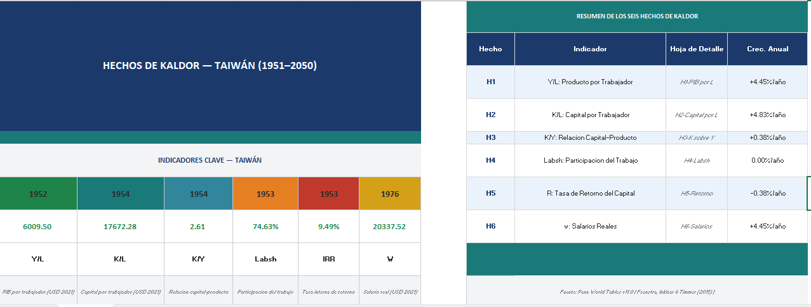

# Kaldor's Stylized Facts Applied to Taiwan (1951–2050)

## Overview
This project empirically validates Kaldor's six stylized facts of economic growth 
using Taiwan as a case study. Built entirely in Microsoft Excel, it combines 
historical data from Penn World Tables (1951–2023) with projections to 2050, 
featuring log-linearized trend lines, exponential regressions, and six fully 
documented economic indicator charts. The analysis also explores why Taiwan 
deviates from Kaldor's predictions during specific periods — most notably during 
the "Taiwan Miracle" of the 1960s–1990s.

## Dashboard Preview

> 📥 **Download the full Excel file** to explore them charts, 
> trend projections, and raw data calculations:
> [Kaldor_Taiwan_Dashboard.xlsx](Kaldor_Taiwan_Dashboard.xlsx)

## Dataset
- **Source:** Penn World Tables v11.0
- **Country:** Taiwan (TWN)
- **Historical period:** 1951–2023
- **Projected period:** 2024–2050 (own elaboration)

## Tools Used
- Microsoft Excel (data processing, chart building, trend projections)
- Penn World Tables v11.0 (primary data source)

## Methodology

| Variable | Formula | Source |
|----------|---------|--------|
| Y/L — GDP per Worker | rgdpe / emp | Penn World Tables v11.0 |
| K/L — Capital per Worker | rnna / emp | Penn World Tables v11.0 |
| K/Y — Capital-Output Ratio | rnna / rgdpe | Penn World Tables v11.0 |
| Labsh — Labor Share | labsh (direct variable) | Penn World Tables v11.0 |
| R — Return on Capital | (1-labsh) × rgdpe / rnna | Penn World Tables v11.0 |
| w — Real Wages | labsh × rgdpe / emp | Penn World Tables v11.0 |
| Trend | Exponential regression on Ln(variable) | Own elaboration |
| Projection 2024–2050 | Extrapolation of average growth rate | Own elaboration |

## Kaldor's Six Stylized Facts — Results for Taiwan

**Fact 1 — GDP per Worker (Y/L) grows at a roughly constant rate**
Confirmed. Taiwan's productivity grew steadily over the long run, consistent with 
Kaldor's first fact. The 1960s–2000s period showed above-trend growth, explained 
by the "Taiwan Miracle" — a structural transformation from low-productivity 
agricultural sectors toward high-productivity export manufacturing.

**Fact 2 — Capital per Worker (K/L) grows at a roughly constant rate**
Confirmed. Despite visible fluctuations, log-linearized variations remain below 
one unit, confirming long-run stability. The late 20th century spike reflects 
Taiwan's intensive capital accumulation phase documented by Alwyn Young, with 
annual capital-output growth rates reaching up to 9%.

**Fact 3 — Capital-Output Ratio (K/Y) grows at a roughly constant rate**
Confirmed with nuance. Data fluctuates between 2 and 4.5, but percentage 
variations are stable on average, especially after the economy matured. The 
1951–1963 period shows atypical decline due to post-WWII lag effects, before 
agrarian reform and industrialization reignited growth.

**Fact 4 — Labor Share (Labsh) remains stable over time**
Confirmed. Taiwan's labor share in income remained historically stable, making 
it a faithful representation of Kaldor's fourth fact.

**Fact 5 — Return on Capital (R) is relatively constant**
Partially confirmed. A slight downward trend is observed, with values ranging 
from a peak of 0.126 in 1965 to a minimum of 0.057 in 2008, stabilizing 
thereafter. The high early returns are consistent with diminishing returns theory 
— when capital was scarce, each new unit of machinery yielded disproportionately 
high returns. As industrialization deepened, returns normalized downward.

**Fact 6 — Real Wages (w) grow at a roughly constant rate**
Confirmed. Real wages show a positive long-run trend consistent with Kaldor's 
prediction. The above-trend period mirrors Fact 1, both driven by the structural 
transformation of the "Taiwan Miracle" and its impact on worker compensation.

## Key Conclusion
Kaldor's stylized facts, applied over long periods, hold valid for Taiwan. 
While fluctuations exist relative to theoretical trend lines, they are not 
strong enough to refute the theory. The most notable deviations are consistently 
explained by the "Taiwan Miracle" — a historically documented structural 
transformation that accelerated growth beyond long-run equilibrium rates 
during the 1960s–1990s.

## References
- Feenstra, R. C., Inklaar, R., & Timmer, M. P. (2021). *Penn World Table (Version 10.01)*. Groningen Growth and Development Centre.
- Young, A. (1995). The Tyranny of Numbers: Confronting the Statistical Realities of the East Asian Growth Experience. *The Quarterly Journal of Economics*.
- Kuo, S. W. Y., Ranis, G., & Fei, J. C. H. (1981). *The Taiwan Success Story: Rapid Growth with Improved Distribution in the Republic of China, 1952–1979*.
- Chow, G. C., & Lin, A. L. (2002). Accounting for Economic Growth in Taiwan and Mainland China: A Comparative Analysis. *Journal of Comparative Economics*.

## Project Structure
├── README.md
├── Kaldor_Taiwan_Dashboard.xlsx
└── kaldor_taiwan_dashboard.PNG

## Author
Juan Ferreira — Data Analyst  
[LinkedIn](https://www.linkedin.com/in/juan-ferreira-110106-forero/) | [GitHub](https://github.com/jcferreiraforero-rgb)

Want me to adjust anything?
